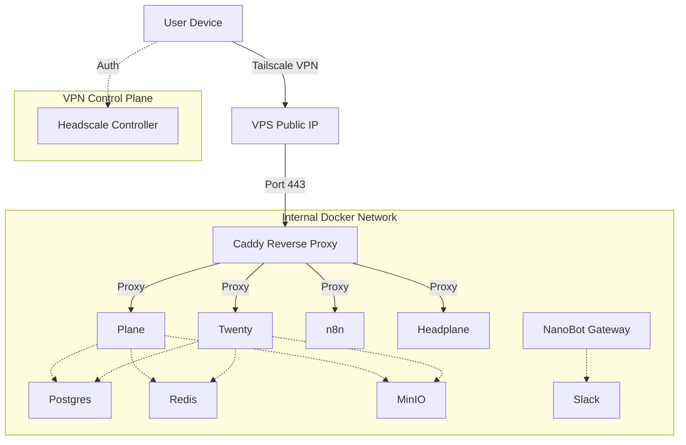

# StartupStack

[](https://www.docker.com/)
[](https://tailscale.com/)
[](https://ubuntu.com/)
[](./LICENCE)
[](./CONTRIBUTING.md)

Production-grade internal company stack designed to run locally and in production using a unified Docker Compose architecture with Headscale/Tailscale VPN access control.

StartupStack bundles foundational tools used by early-stage companies, with minimal configuration drift between development and production.

---

## Features & Services

This repository provides infrastructure-only (Docker Compose + Config). It orchestrates:

| Service | Purpose | Database / Storage |
| :--- | :--- | :--- |
| **Plane** | Project & Issue Management | PostgreSQL, Redis, MinIO |
| **Twenty** | CRM | PostgreSQL, Redis, MinIO (bucket isolated) |
| **n8n** | Automations & Workflow Automation | SQLite (default) or Postgres |
| **NanoBot (optional)** | AI company assistant (Slack-first) | `NANOBOT_STATE_DIR` + `NANOBOT_OAUTH_DIR` |
| **Headscale** | Private Mesh VPN Controller | SQLite / Embedded |
| **Headplane** | Web UI for Headscale | - |
| **MinIO** | S3-compatible Object Storage | Filesystem |
| **Caddy** | Reverse Proxy & Auto-TLS | - |

> Philosophy: One stack. Same manifests. Different env values. No Kubernetes. No Helm. No Terraform. No VM drift.

---

## Architecture

### Network Flow



### Security Model
1. Public exposure: only Headscale control-plane traffic is publicly reachable.
2. Private access: Plane, Twenty, and n8n stay behind VPN access.
3. Authentication: access is enforced by Tailnet membership.
4. NanoBot (Slack mode): outbound-only integration, no public inbound NanoBot route required.

### Storage Model
- Plane and Twenty share one MinIO service (`minio`).
- Bucket isolation is enforced: Plane uses `plane`, Twenty uses `twenty`.
- Twenty currently uses the same MinIO credentials as Plane (`MINIO_ROOT_*`) for simpler operations.
- Existing Plane object data remains untouched as long as `PLANE_BUCKET=plane` is unchanged.
- The canonical host data path is `/data/minio`.

---

## Repository Structure

```text
startupstack/
├── compose/
│   ├── compose.yml
│   ├── compose.local.yml
│   └── compose.prod.yml
├── external/
│   └── nanobot/            # git submodule (upstream NanoBot)
├── env/
│   ├── .env.example
│   ├── .env.local
│   └── .env.prod
├── scripts/
│   ├── setup
│   ├── up
│   ├── down
│   ├── nanobot-cli
│   ├── bootstrap
│   ├── join-tailnet
│   └── vpn-keygen
└── docs/
```

---

## Quick Start: Local Development

1. Clone repository:
   ```bash
   git clone https://github.com/Celerinc/startupstack.git
   cd startupstack
   git submodule update --init --recursive
   ```
2. Prerequisites: install Docker + Docker Compose.
3. Configure environment:
   ```bash
   cp env/.env.example env/.env.local
   ```
4. Start core services:
   ```bash
   ./scripts/up local
   ```
5. Access services:
   - Plane: http://localhost:8080
   - Twenty: http://localhost:3002
   - n8n: http://localhost:5678
   - MinIO Console: http://localhost:9001

### Optional: Start NanoBot
```bash
./scripts/up local ai
```

NanoBot state and OAuth paths are configurable via:
- `NANOBOT_STATE_DIR` (for example `/home/deploy/agents/.alex`)
- `NANOBOT_OAUTH_DIR` (for example `/home/deploy/agents/.oauth`)

---

## Production Deployment (VPS)

### 1. Prerequisites
- A domain pointed to your VPS IP.
- Recommended DNS:
  - `hs.example.com`
  - `plane.example.com`
  - `twenty.example.com`
  - `n8n.example.com`
  - `s3.example.com`

### 2. Provision + boot
```bash
git submodule update --init --recursive
./scripts/setup prod
nano env/.env.prod
./scripts/up prod
```

### 3. Configure VPN
```bash
./scripts/bootstrap
./scripts/join-tailnet
```

### 4. Optional: enable NanoBot
```bash
./scripts/up prod ai
```

Codex-oriented defaults are supported through env vars:
- `NANOBOT_PROVIDER=openai`
- `NANOBOT_MODEL=openai/gpt-5.3-codex`
- `NANOBOT_REASONING_EFFORT=low`

---

## Management & Troubleshooting

- Stop services:
  ```bash
  ./scripts/down
  ```
- Tail logs:
  ```bash
  docker compose -f compose/compose.yml logs -f plane-api
  ```
- Data persistence: `/data` on the host.
- Shared object storage: Plane and Twenty use the same MinIO instance with separate buckets.
- NanoBot persistence: `NANOBOT_STATE_DIR` (state/workspace) and `NANOBOT_OAUTH_DIR` (shared OAuth sessions).
- If Slack logs show `missing_scope` for reactions, add `reactions:write` in your Slack bot token scopes.

---

## Roadmap

- [x] CRM integration (Twenty)
- [ ] ClickHouse analytics profile
- [ ] Monitoring stack (Prometheus/Grafana)

## License

Released under the [MIT License](./LICENCE).
