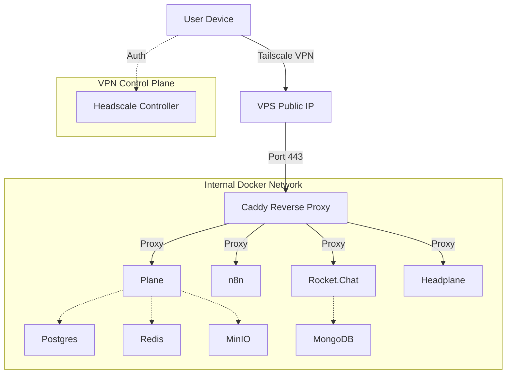

# StartupStack

[](https://www.docker.com/)
[](https://tailscale.com/)
[](https://ubuntu.com/)
[](./LICENCE)
[](./CONTRIBUTING.md)


**Production‑grade internal company stack** designed to run **locally and in production** using a unified Docker Compose architecture with Headscale/Tailscale VPN access control.

StartupStack bundles a curated set of foundational tools used inside modern early‑stage companies, configured to work seamlessly together with minimal configuration drift between development and production.

---

## 🚀 Features & Services

This repository provides **infrastructure-only** (Docker Compose + Config). It orchestrates the following services:

| Service | Purpose | Database / Storage |
| :--- | :--- | :--- |
| **Plane** | Project & Issue Management | PostgreSQL, Redis, MinIO |
| **n8n** | Automations & Workflow Automation | SQLite (default) or Postgres |
| **Rocket.Chat** | Internal Team Chat | MongoDB |
| **Headscale** | Private Mesh VPN Controller | SQLite / Embedded |
| **Headplane** | Web UI for Headscale | - |
| **MinIO** | S3-compatible Object Storage | Filesystem |
| **Caddy** | Reverse Proxy & Auto-TLS | - |

> **Philosophy**: One stack. Same manifests. Different env values. No Kubernetes. No Helm. No Terraform. No VM drift.

---

## 🏗 Architecture

### Network Flow



### Security Model
1.  **Public Exposure**: Only **Headscale** (VPN Controller) is exposed to the public internet on port 443.
2.  **Private Access**: All applications (Plane, n8n, Rocket.Chat) are hidden behind the VPN. They are **not** accessible via public IP.
3.  **Authentication**: Access is enforced by membership in the Tailnet. If you are not connected to the VPN, you cannot reach the services.

---

## 📂 Repository Structure

```text
startupstack/
├── compose/                # Docker Compose definitions (Modular)
│   ├── compose.yml         # Base shared services (Networks, Images, Volumes)
│   ├── compose.local.yml   # Overrides for specific ports in Local dev
│   └── compose.prod.yml    # Overrides for Volume paths & Exposure in Prod
├── env/                    # Environment Variables
│   ├── .env.example        # Template for all required vars
│   ├── .env.local          # Local development secrets
│   └── .env.prod           # Production secrets (GitIgnored)
├── scripts/                # Automation utilities
│   ├── setup               # VPS provisioning (Docker, Dirs, Perms)
│   ├── up                  # Universal start command (Local/Prod)
│   ├── bootstrap           # Initialize Headscale & DNS
│   ├── join-tailnet        # Connect VPS to the Tailnet
│   └── vpn-keygen          # Generate auth keys for user devices
└── docs/                   # Detailed documentation
```

---

## ⚡️ Quick Start: Local Development

Run the entire full-stack locally with port forwarding.

1.  **Prerequisites**: Install Docker & Docker Compose.
2.  **Configure Environment**:
    ```bash
    cp env/.env.example env/.env.local
    # Edit env/.env.local if needed (defaults usually work for local)
    ```
3.  **Start Services**:
    ```bash
    ./scripts/up local
    ```
4.  **Access Services**:
    - **Plane**: http://localhost:8080
    - **n8n**: http://localhost:5678
    - **Rocket.Chat**: http://localhost:3000
    - **MinIO Console**: http://localhost:9001

---

## 🌍 Production Deployment (VPS)

Deploy to a fresh Ubuntu/Debian VPS.

### 1. Prerequisites
- A domain name (e.g., `example.com`) pointed to your VPS IP.
- Recommended DNS records:
  - `hs.example.com` (Headscale)
  - `plane.example.com`
  - `n8n.example.com`
  - `chat.example.com`

### 3. Provision & Boot
Run the setup script which installs Docker, generates your configuration, and prepares directories.

```bash
# 1. Run Setup (Generates env/.env.prod)
./scripts/setup prod

# 2. Review the generated config
nano env/.env.prod
# Verify DOMAIN, EMAIL and other settings

# 3. Start the stack
./scripts/up prod
```

### 4. Configure VPN
Now that the stack is running, initialize the VPN control plane.

```bash
# 1. Initialize Headscale user & Namespace
./scripts/bootstrap

# 2. Connect the VPS itself to the Tailnet
./scripts/join-tailnet
```

### 5. Client Access
To access your apps, your laptop must join the Tailnet.

```bash
# Generate a pre-auth key for your device (e.g., 'my-macbook')
./scripts/vpn-keygen my-macbook
```
1.  Install [Tailscale](https://tailscale.com/download) on your device.
2.  Login to your **custom control server** (Headscale):
    - **MacOS/Windows**: Shift-Click the Tailscale icon -> Debug -> "Add Account..." -> Use your `https://hs.example.com` URL.
    - **Linux**: `tailscale up --login-server https://hs.example.com --authkey <YOUR_KEY>`

Once connected, you can access your apps at `https://plane.example.com`, etc.

---

## 🛠 Management & Troubleshooting

- **Stop Services**:
  ```bash
  docker compose -f compose/compose.yml -f compose/compose.prod.yml down
  # OR use the helper
  ./scripts/down
  ```
- **Logs**:
  ```bash
  docker compose -f compose/compose.yml logs -f plane-api
  ```
- **Filesystem**: Data is persisted in `/data` on the host machine.


## 🗺️ Roadmap

- [ ] **CRM Integration**: Evaluate and integrate an open-source CRM (e.g., [Twenty](https://twenty.com)) to complete the business stack.
- [ ] **ClickHouse**: Enable analytics stack (currently optional/commented out).
- [ ] **Monitoring**: Add Prometheus/Grafana for stack observability.

## 📄 License
Released under the [MIT License](./LICENCE).
